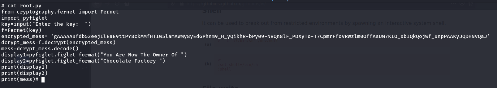

# Chocolate Factory Resolução

Como qualquer CTF vamos começar com um scan de portas:

Logo de cara recebemos muitas informações na tela, mas vamos por partes.  
Para começar dou uma olhada no serviço de FTP o NMAP Conseguiu fazer login com um usuário público, e nos mostra que ha uma foto no servidor FTP, vamos baixa-la.

Após baixa-la tento extrair algo com `steghide` consigo um arquivo `b64.txt` sem senha alguma, é possível fazer o decode do conteudo com `cat b64.txt | base64 -d`

Recebemos uma hash, próximo passo seria quebra a hash com o `john` ou `hashcat`  
Após a quebra da hash temos enfim uma senha:

Pelo formato do arquivo somos induzidos a pensar que a senha é de um usuário SSH, porém não temos sucesso com o login, agora que analisei tudo que era possível no FTP e em seus arquivos, vou para o sevidor Apache:

Logo de cara temos uma página de login, já temos uma credencial que não era de um SSH então vamos testar aqui:

sucesso, estamos logado, e de cara o site nos solicita um comando, podemos tentar um simples `ls`

>Temos um RCE (REMOTE CODE EXECUTION) confirmado.

A partir dai fica fácil pegar uma Revers shell, mas antes, ha um arquivo que me chama a atenção `key_rev_key`, este mesmo arquivo aparece no NMAP:

um simples `cat` neste arquivo já serve, porem podemos baixar em `http://< IP >/key_rev_key`, fica a escolha:

Temos uma nova *string* misteriosa, vamos guardá-la e partir para uma revers shell.  
Procurando um pouco pelo servidor podemos encontrar uma `id_rsa` que pode ser bem util para elevar um pouco nosso previlégio:

>* Lembrando que para utilizar uma chave rsa ela deve estar com as permissões certas.
>* `chmod 600 id_rsa`  
>* `ssh -i id_rsa user@ip`

Agora que temos um novo usuário, uma das primeiras coisas ha se fazer é dar uma olhada nas permissões :

Vemos que o usuário tem a permissões  de utilizar o `/usr/bin/vi` como root sem precisar de senhas e ao olharmos o site [GFTobins](https://gtfobins.github.io/) vemos que é bem fácil pegar uma shell como root utilizando o `vi`.  
Enfim chegamos na parte mais complicada do desafio, temos uma shell como root mas não temos a última flag e no `/root` temos um `root.py` que nos pede um uma key.
>Código fonte:

Tentei algumas palavras aleatórias mas percebi que não levaria a nada, o código fonte também não nos diz muita coisa, foi então que me lebrei da key dentro do arquivo `key_rev_key` ao olhar a key novamente percebi que a key tinha um `b'key'`, quem já tem o básico de python sabe que para transformar uma *string* em *bytes* basta passar um `b'string'` antes da *string* então porque não testar...
>key:

Sucesso temos nossa última flag:

